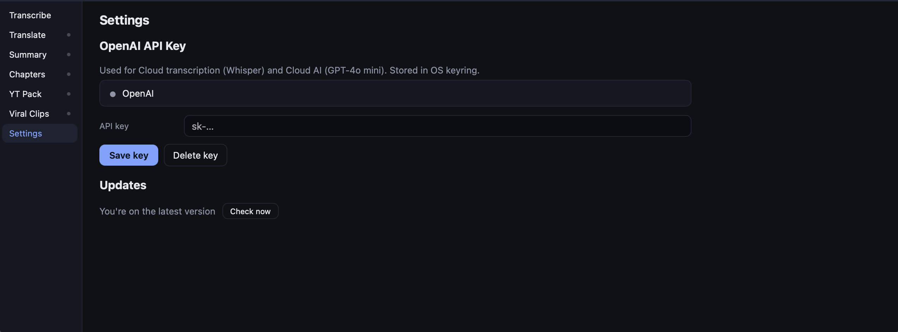
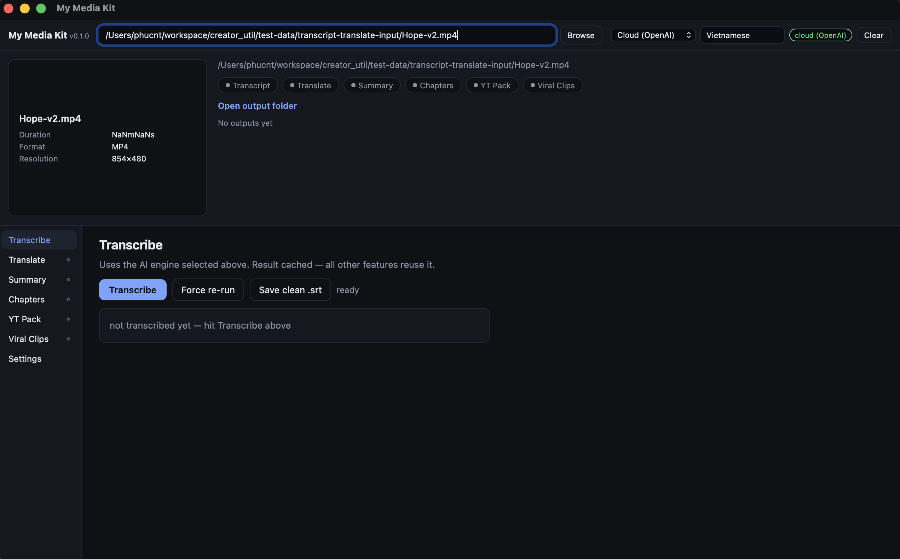
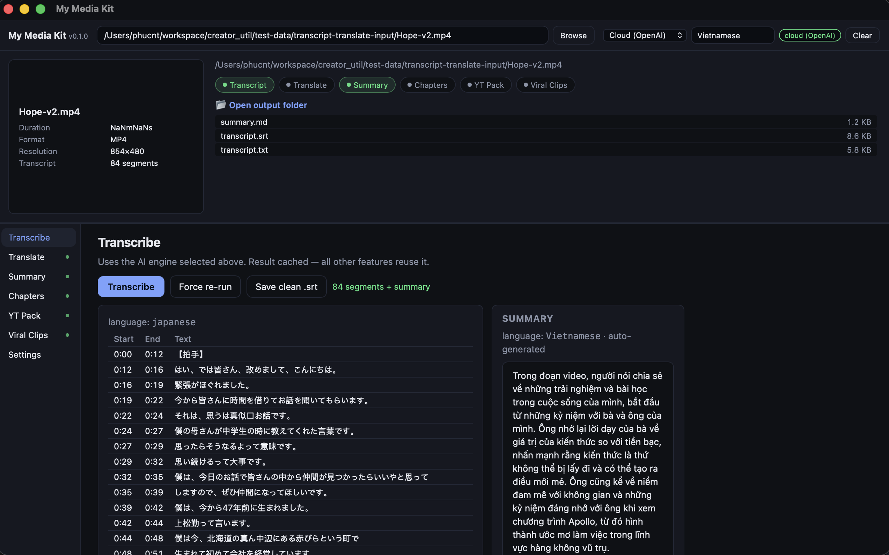
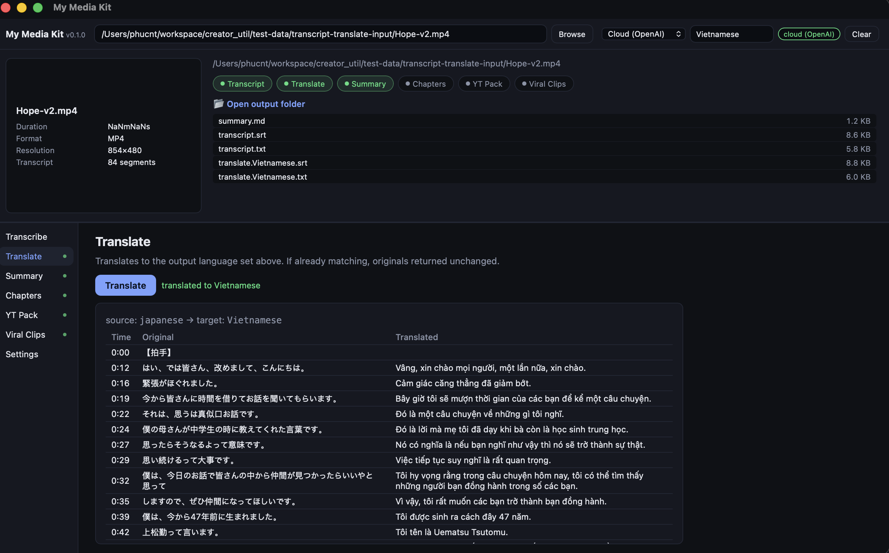
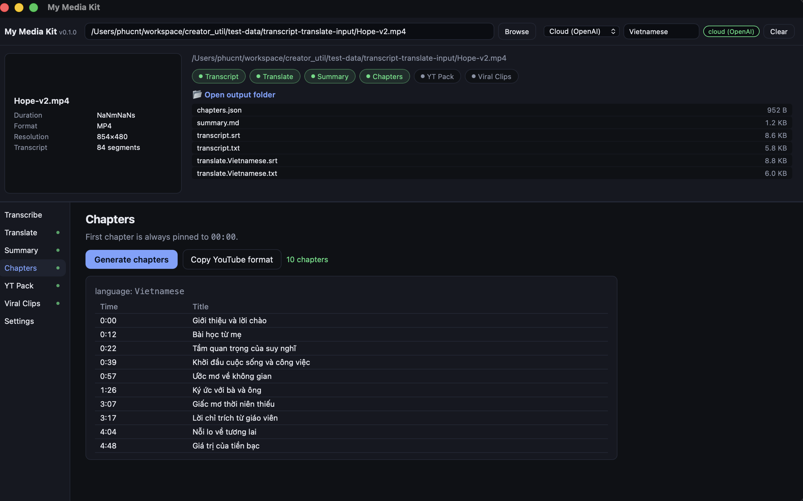
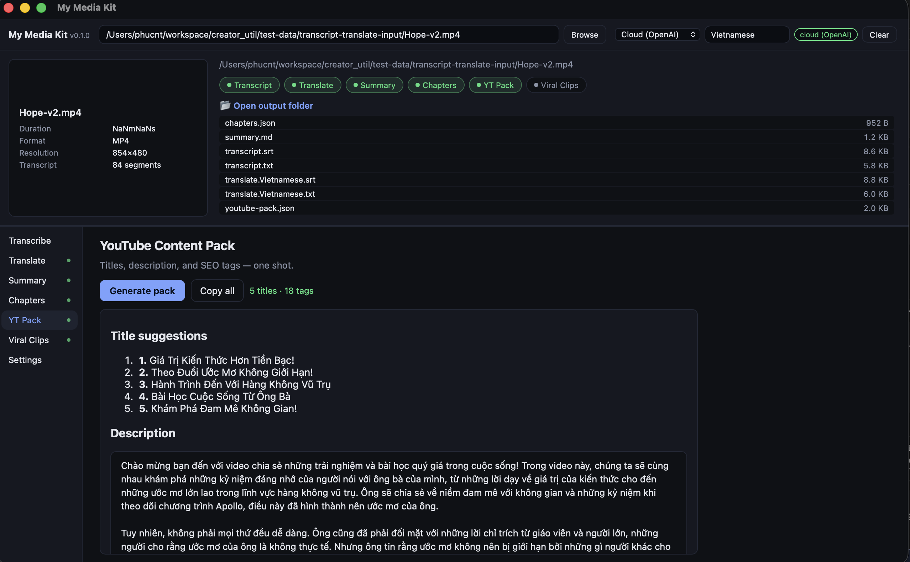
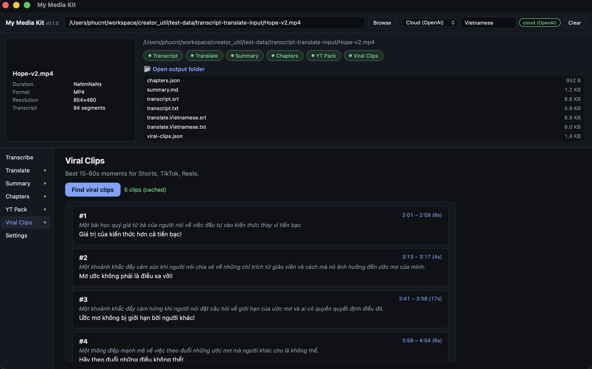
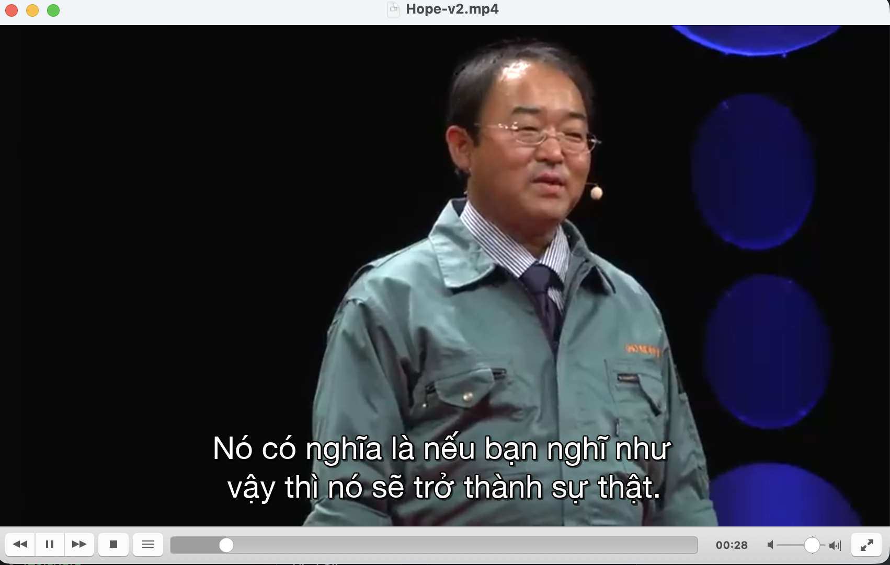

<p align="center">
  
</p>

<h1 align="center">My Media Kit</h1>

<p align="center">
  Bộ công cụ AI cho creator: từ 1 video → transcript, dịch, summary, chapters,
  YouTube pack, viral clips. Chạy local (Apple Silicon) hoặc cloud (OpenAI).
</p>

---

## Dùng để làm gì?

### 🎓 Xem bài giảng / phim / podcast chưa có phụ đề

Ví dụ: bạn tìm thấy một talk hay trên YouTube nhưng chỉ có tiếng Anh hoặc Nhật, không có sub Việt.

1. Paste link YouTube vào app → app tự download.
2. Bấm **Transcribe** → 1–2 phút có transcript đầy đủ với timestamp.
3. Bấm **Translate** → app dịch sang tiếng Việt, xuất ra file `.srt`.
4. Mở file video bằng **VLC / IINA / QuickTime / MPV / CapCut**, kéo-thả file `.srt` vào → có phụ đề tiếng Việt khớp giây ngay lập tức.

### 🎬 Sản xuất nội dung video cho YouTube / TikTok / Reels

Ví dụ: bạn vừa quay xong 1 video 30 phút, cần đẩy lên YouTube + cắt clip ngắn cho TikTok.

1. Kéo-thả file video vào app.
2. **Transcribe** xong → có sẵn:
   - **Summary** để viết caption / mô tả.
   - **Chapters** để paste vào description YouTube (auto-format chuẩn `MM:SS Tên chương`).
   - **YouTube Pack** — 5 title gợi ý + description SEO + 15–20 tag.
   - **Viral Clips** — gợi ý 3–5 đoạn 15–60 giây hay nhất kèm caption sẵn để cắt cho Shorts/Reels/TikTok.
3. **Translate** sang ngôn ngữ khác → mở rộng audience quốc tế. SRT import thẳng vào **Premiere / DaVinci / Final Cut / CapCut** làm subtitle track.

Tiết kiệm 1–2 giờ chỉnh sửa metadata + cắt clip cho mỗi video.

### 📚 Học ngoại ngữ qua nội dung gốc

1. Paste video tiếng nước ngoài (TED Talk, anime, drama Hàn…).
2. Lấy transcript bản gốc + bản dịch song song → đọc đối chiếu.
3. Mở video kèm SRT để vừa nghe vừa nhìn 2 ngôn ngữ.

---

## Tính năng

- **Tải video YouTube** ngay trong app, paste link là xong.
- **Transcribe** với word-level timestamp (Whisper).
- **Translate** giữ nhất quán thuật ngữ xuyên suốt video dài.
- **Summary / Chapters / YouTube Pack / Viral Clips** — sinh tự động từ transcript.
- **Xuất SRT chuẩn** — dùng được với mọi player + video editor + YouTube Studio.
- **2 mode AI**:
  - **Cloud (OpenAI)** — mặc định, nhanh, chỉ cần API key.
  - **MLX (local)** — chạy 100% offline trên Apple Silicon.

---

## Cài đặt

### macOS (Apple Silicon — M1/M2/M3/M4)

1. Tải file `.dmg` từ trang [Releases](https://github.com/phuc-nt/my-media-kit/releases/latest).
2. Mở `.dmg` → kéo **MyMediaKit.app** vào thư mục **Applications**.
3. Mở app từ Launchpad. Lần đầu macOS có thể hỏi → bấm **Open**.

> App đã được Apple notarize → không cần `xattr` hay tắt Gatekeeper.

### Windows 10/11 (64-bit)

1. Tải file `.exe` (NSIS) hoặc `.msi` từ trang [Releases](https://github.com/phuc-nt/my-media-kit/releases/latest).
2. Chạy installer → Next → Install.
3. Mở app từ Start Menu.

> Windows SmartScreen có thể cảnh báo lần đầu → bấm **More info** → **Run anyway**.

---

## Setup lần đầu



App mặc định chạy **Cloud (OpenAI)**, cần API key:

1. Vào tab **Settings** ở sidebar.
2. Lấy key tại [platform.openai.com/api-keys](https://platform.openai.com/api-keys) (bắt đầu bằng `sk-...`).
3. Paste vào ô **API key** → bấm **Save key**.

Key lưu trong **OS Keychain** (Apple Keychain / Windows Credential Manager) — không nằm trong file plain text.

> Chỉ làm 1 lần. Lần sau mở app dùng được luôn.

### (Tùy chọn) MLX local — chạy offline trên Apple Silicon

Nếu muốn chạy AI hoàn toàn trên máy (không tốn API, không gửi data lên cloud):

```bash
# Cài Python (nếu chưa có)
brew install python

# Cài MLX runtime
pip install mlx-whisper mlx-lm
# hoặc
pipx install mlx-whisper mlx-lm
```

Yêu cầu: Mac M1/M2/M3/M4, ≥ 16 GB RAM, ~9 GB dung lượng cho model Qwen3-14B.

App tự nhận biết MLX đã cài → bật option **MLX (local)** trong dropdown.

---

## Cách sử dụng

### Quy trình chuẩn (5 bước)



1. **Nạp video** — kéo-thả file vào app, hoặc bấm **Browse**, hoặc paste link YouTube.
2. **Bấm Transcribe** — Whisper chạy, summary tự sinh ngay bên cạnh.
3. **Translate** (tab Translate) — chọn ngôn ngữ đích, bấm Translate.
4. **Chapters / YT Pack / Viral Clips** — chạy độc lập, song song được.
5. **Mở thư mục output** (link xanh ở khu source info) → có sẵn 6–7 file để dùng.

### Output files trong `{video}_output/`

| File | Tính năng |
|------|-----------|
| `transcript.srt` / `.txt` | Transcribe |
| `clean.srt` | Save clean .srt (lọc filler) |
| `summary.md` | Summary |
| `translate.{Lang}.srt` / `.txt` | Translate |
| `chapters.json` | Chapters |
| `youtube-pack.json` | YT Pack |
| `viral-clips.json` | Viral Clips |

App tự scan thư mục output khi mở lại video → status badge xanh hiện ngay, click tab tương ứng sẽ load lại kết quả từ disk (không phải chạy lại AI).

---

## Screenshots

<table>
  <tr>
    <td></td>
    <td></td>
  </tr>
  <tr>
    <td align="center"><sub>Transcribe + auto Summary</sub></td>
    <td align="center"><sub>Translate (Japanese → Vietnamese)</sub></td>
  </tr>
  <tr>
    <td></td>
    <td></td>
  </tr>
  <tr>
    <td align="center"><sub>Chapters cho YouTube</sub></td>
    <td align="center"><sub>YouTube Content Pack</sub></td>
  </tr>
  <tr>
    <td></td>
    <td></td>
  </tr>
  <tr>
    <td align="center"><sub>Viral Clips cho Shorts/Reels/TikTok</sub></td>
    <td align="center"><sub>Phụ đề Vietnamese trên video</sub></td>
  </tr>
</table>

---

## So sánh Cloud vs MLX

| | Cloud (OpenAI) | MLX (local) |
|---|---|---|
| Tốc độ | Vài giây/feature | 1–10 phút/feature |
| Chi phí | Trả per token (rẻ) | Miễn phí (sau khi tải model) |
| Privacy | Gửi qua OpenAI | 100% offline |
| RAM | Không tốn | Cần 16 GB+ |
| Yêu cầu | API key | Apple Silicon + Python + MLX packages |

**Khuyến nghị**: dùng Cloud cho công việc hàng ngày. Switch MLX khi cần xử lý nội dung nhạy cảm hoặc làm offline.

---

## Troubleshooting

**`download failed` khi paste link YouTube**
- Update lên phiên bản mới nhất (anti-bot của YouTube đổi liên tục).

**Cloud features fail với `400 Bad Request`**
- Kiểm tra API key trong Settings còn hợp lệ và còn credit.

**MLX option bị disable**
- Cài `mlx-whisper` + `mlx-lm` qua pip/pipx (xem mục Setup).
- Restart app sau khi cài.

**Còn vấn đề khác?** Mở issue tại [GitHub Issues](https://github.com/phuc-nt/my-media-kit/issues).

---

<p align="center">
  <a href="https://github.com/phuc-nt/my-media-kit">GitHub repo</a> ·
  <a href="https://github.com/phuc-nt/my-media-kit/releases/latest">Tải bản mới nhất</a> ·
  <a href="https://github.com/phuc-nt/my-media-kit/issues">Báo lỗi</a>
</p>
